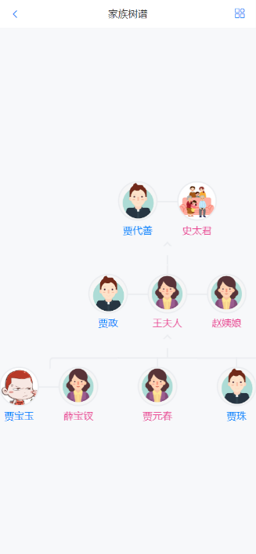
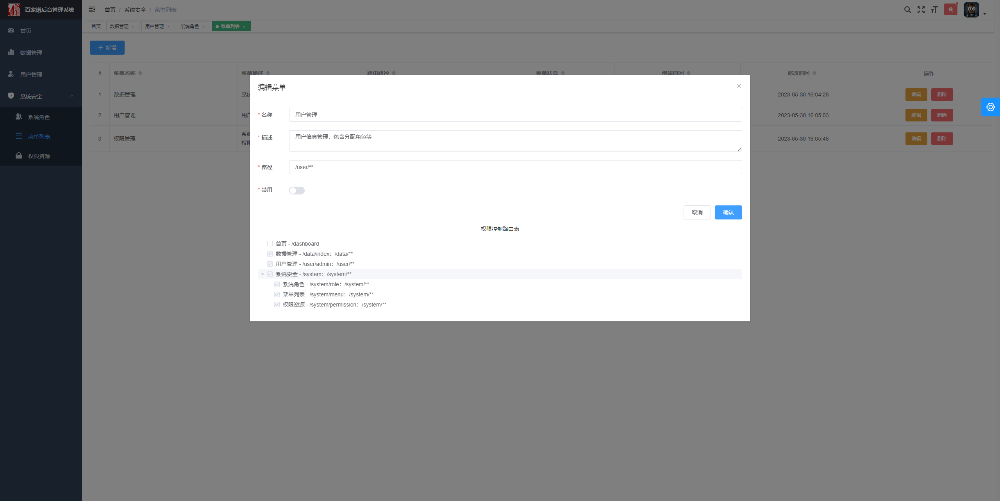

<p align="center">
    
    
    
     
    <a href="https://github.com/springbear2020/graduation-ifamily" target="_blank">
        
    </a>
</p>

# 一、快速开始

## 1.1 后端服务系统

1. 克隆仓库：使用 Git 克隆仓库或直接下载仓库压缩包到您的计算机来获取源代码。
2. 打开工程：使用 IntelliJ IDEA 开发工具打开 ifamily-server 后端服务系统模块，而后使用 Maven 项目构建工具更新工程模块依赖。
3. 创建数据库并导入数据：登录 MySQL 控制台，依据 document/sql 目录下的 6 个 SQL 脚本文件创建六个数据库，并导入数据库表和数据。
4. 修改配置：
   - 修改 ifamily-server/ifamily-service/ifamily-\*/\*\*/application.yml 六个模块中的数据库连接信息，设置你自己的 MySQL 数据库用户名和密码。
   - 修改 ifamily-server/ifamily-service/ifamily-backend/\*\*/application.properties 中的 MySQL 数据库 root 账户密码信息。
   - 修改 ifamily-server 下除 ifamily-common 外 8 个模块 application.yml 中的 Nacos 配置信息，默认配置为 localhost:8848。
5. 可选配置：
   - ifamily-server/ifamily-service/ifamily-manager/\*\*/application.yml：修改其中的 [邮箱服务器](https://blog.csdn.net/smilehappiness/article/details/108145215) 信息，设置你自己的邮箱账号和服务器，如不修改则邮箱验证码功能不可用。
   - ifamily-server/ifamily-service/ifamily-manager/\*\*/application.properties：修改其中的 [七牛云](https://www.qiniu.com/) 配置信息，设置你自己的七牛云账户 AK 信息，若不修改则图片云存储相关服务不可用。
6. 启动后台服务：
   - 启动 Redis 服务：进入 Redis 安装目录下，双击 redis-server.exe 以启动 Redis 数据库服务。
   - 启动 Nacos 服务：进入 Nacos 安装目录下的 bin 目录，在控制台以 startup.cmd -m standalone 命令以单机模式启动 Nacos 服务。
7. 启动后端服务：在 IntelliJ IDEA 中批量启动所有后台服务，包括一个网关（gateway）、一个验证（auth）和六个业务（service）服务。

## 1.2 移动应用系统

> 注：请确保 **1.1 后端服务系统** 中的一个网关（gateway）、一个验证（auth）和六个业务（service）服务正常启动以提供正常的接口功能。

1. 克隆仓库：使用 Git 克隆仓库或直接下载仓库压缩包到您的计算机来获取源代码。
2. 打开工程：使用 WebStorm 开发工具打开 ifamily-mobile 移动应用系统模块。
3. 安装依赖：在控制台使用 npm install 命令安装工程所需依赖。
4. 修改配置：
   - ifamily-mobile/src/utils/request.js：修改该文件中 baseURL 变量的值为后端服务系统网关模块的地址，默认为 http://localhost:8888。
5. 启动系统：在控制台使用 npm run serve 命令启动工程。
6. 登录系统：默认用户名和密码均为 jiabaoyu。

## 1.3 后台管理系统

> 注：请确保 **1.1 后端服务系统** 中的一个网关（gateway）、一个验证（auth）和六个业务（service）服务正常启动以提供正常的接口功能。

1. 克隆仓库：使用 Git 克隆仓库或直接下载仓库压缩包到您的计算机来获取源代码。
2. 打开工程：使用 WebStorm 开发工具打开 ifamily-backend 后台管理系统模块。
3. 安装依赖：在控制台使用 npm install 命令安装工程所需依赖。
4. 修改配置：
   - ifamily-backend/src/utils/request.js：修改该文件中 BASE_REQUEST_URL 变量的值为后端服务系统网关模块的地址，默认为 http://localhost:8888。
5. 启动系统：在控制台使用 npm run serve 命令启动工程。
6. 登录系统：默认用户名和密码均为 root。

# 二、项目背景

传统家谱文献以纸质制成，记录内容包含众多，编制格式复杂，随着世代增加，家谱中的人物呈指数级增长，使得家谱在传播、利用及查询上存在很大局限。为了满足当代家族对家谱管理和文化传承的迫切需求，本文介绍了基于 Spring Cloud 和 Vue 框架实现的家谱服务系统。

该系统旨在设计和开发一款功能多样、操作简单的综合性数字化家族谱系服务平台。为了实现这一目标，系统被细分为移动端前台应用系统和桌面端后台管理系统。前台系统为家族成员提供了丰富的家族数据呈现功能，如家族成员树、世代成员列表、家族大事记和成员社交动态等，进而增进了家族成员之间的血缘联结。后台系统为管理员提供了管理家族信息的统一化平台，包括系统权限管理和家族成员管理等功能。

系统的前台用户页面是基于 Vue 框架实现的现阶段最流行的 SPA（单页应用）。单页面应用的特点是所有页面的加载全部在一个窗口中进行，并通过路由实现页面跳转。界面设计清晰简洁，交互逻辑性强，为用户提供友好的交互体验和界面展示。用户可以轻松地浏览家族成员信息和了解家族历史，同时还可以与其他家族成员进行分享和互动，良好的交互设计有助于增强家族成员之间的联系和认同感。

后台服务系统采用了面向服务的体系架构（SOA），分布式 SOA 架构的特点有：分布式、可复用、拓展灵活、松耦合。通过微服务化的体系架构，实现了各个业务模块的松耦合，从而提高了系统的可维护性、稳定性和高可用性，这种分布式的架构使得系统更加稳定可靠，能够处理大量的数据和用户请求。

综上所述，本家谱服务系统为家族提供了一个全面的数字化管理平台。通过前台系统和后台系统的结合，家族成员可以轻松地了解和共享家族的历史与信息，家族管理员可以高效地管理和维护家族谱系，并且系统具备良好的用户体验、可扩展性和可维护性，为当下家族的发展和文化传承提供了有力支持。

# 三、系统架构

本系统（以下简称百家谱）是一个提供前台应用系统和后台管理系统的现代化、多功能和易上手的家谱服务系统。旨在帮助用户轻松地创建和管理自己的家族数据，提供一个便捷的平台来保存、共享和传承家族的历史，以满足当下家族对家谱管理和文化传承的迫切需求。系统具备良好的用户体验、灵活的界面定制能力和高可靠性的服务端架构。

前台应用系统：百家谱移动端前台应用系统采用了 Vue 框架和 Vant 组件库，这使得系统能够以组件化的方式构建前端页面，提高了代码的可维护性和可复用性。通过使用移动端 UI 组件库 Vant 所提供的丰富组件和交互功能，百家谱移动应用实现了一致的页面风格，为用户提供了友好的界面和出色的交互体验。这大大提升了系统的开发效率，并使得用户能够更加轻松地使用和浏览应用。

后台管理系统：百家谱桌面端后台管理系统基于 vue-element-admin 模板库。vue-element-admin 是一款基于 Vue 和 Element UI 的强大后台管理系统模板，它为开发者提供了众多的实用组件和灵活的布局选项，能够快速搭建功能完善和页面精美的现代化后台管理系统。通过对 vue-element-admin 路由和权限管理功能的定制与扩展，从而实现粒度极细的访问权限控制，最大程度上保证了系统的安全性和数据的保密性。

后端服务系统：百家谱后端服务系统基于 Spring Cloud 分布式微服务架构。这种架构将原有的大体量的单个应用拆分为多个独立的微服务，使得每个服务更专注于自己的业务，能够很方便地进行水平扩展，从而使得整个系统进一步解耦。极大地提升了系统在高负载、高可用和高并发方面的能力，这样的架构设计为百家谱平台的稳定运行和未来发展奠定了坚实的基础。通过 Spring Cloud 提供的 Discovery，OpenFeign 等实用组件实现微服务的动态注册、发现与调用，以及模块间的依赖解耦。此外，Gateway 网关组件能够实现对外暴露统一的接口，完成统一的认证和鉴权，进一步提升系统的安全性和可靠性。


# 四、系统设计

前台应用系统：百家谱移动端前台应用系统主要包含主页、家族和用户三大模块，详细的模块设计如下图所示。


后台管理系统：百家谱后台管理系统主要包含了家族、用户、数据、日志和配置五大模块，详细的模块设计如下图所示。


后端服务系统：百家谱后端服务系统主要包含了通用、认证、网关和业务四大模块。模块功能不一却又相互依赖、相辅相成，共同协作为前台应用系统和后台管理系统提供业务数据支持，详细的模块设计如下图所示。


数据库设计：百家谱是一个微服务架构的家谱服务系统，每个微服务模块 ifamily-service 仅仅关注处理与自己业务逻辑有关的业务，拥有自己独立的数据库。每个业务模块数据库表众多，整个百家谱系统的数据库 E-R 图如下所示。


# 五、技术架构

如图所示，该图清晰明了地展示了本研究系统开发过程中各个层次模块使用到的技术栈、开发工具和运行环境，以及各项技术和工具之间的关联与依赖关系，使得整个系统的技术层次一目了然，为系统开发提供参考和指导。这些技术和工具在构建现代化、安全和可靠的 Web 应用程序方面发挥了重要作用，下面将对其中极为典型的开发技术进行详细介绍。

Vue.js 是一款现代化、轻量级、用于快速构建用户页面的 JavaScript 框架，旨在简化 Web 应用的开发，常用于开发现阶段流行的单页应用（Simple Page Application）。具体来说，Vue.js 是一款依赖于模型-视图-视图模型（MVVM）的渐进式框架，通过其提供的一系列简单易上手的内置 API，为开发者打造了优雅流畅的前端体验。

MySQL 是一款可在多种操作系统平台上运行的开源 RDBMS（Relation Database Management System）。它以出色的性能、可靠性和灵活性备受企业和个人开发者喜爱，得到了开源社区的广泛支持。

Spring Cloud 技术框架并非是单一技术组成的框架，而是由其他一系列框架所组成的有序框架集合。Spring Cloud 中提供了一系列实用组件等，帮助开发人员更轻松地构建和管理分布式应用。其中 Gateway、Discovery 和 OpenFeign 是 Spring Cloud 最为核心的三个组件，在微服务架构中发挥着举足轻重的作用，也是本研究中用到的 Cloud 组件。

Spring Security 是一个开源的 Java 框架，提供高度灵活的身份验证、授权和访问控制解决方案。其通过一系列过滤器组成的过滤器链，为系统提供身份认证（Authentication）和授权（Authorization）功能，从而帮助开发者构建安全可靠的应用程序。Spring Security 提供了一套简单且易于使用的 API，用于管理用户身份验证、授权和其他安全性功能。它的主要目标是保护应用程序免受各种安全威胁，例如身份伪造、会话固定、跨站点请求伪造（CSRF）和跨站点脚本（XSS）攻击。

OAuth2 是一种用于授权第三方应用程序访问用户资源的安全协议。它允许用户让第三方应用访问用户在某个网站上存储的私密资源（例如照片、联系人通信录、视频等)，而不需要将用户名和密码提供给第三方应用。许多大型互联网平台和服务商都采用 OAuth2 作为其授权框架，以确保用户数据的安全。开发者可以使用现有的 OAuth2 框架来简化实现，如 Spring Security OAuth、Okta、Auth0 等。


# 六、工程结构


| 工程名          | 子模块            | 监听端口 |   功能描述   |
| :-------------- | :---------------- | :------: | :----------: |
| ifamily-server  |                   |          |              |
|                 | ifamily-auth      |   9420   | 认证鉴权模块 |
|                 | ifamily-gateway   |   8888   | 统一网关服务 |
|                 | ifamily-acl       |   1372   | 访问控制服务 |
|                 | ifamily-backend   |   1573   | 后台管理服务 |
|                 | ifamily-genealogy |   7319   | 家族核心服务 |
|                 | ifamily-manager   |   7086   |  第三方业务  |
|                 | ifamily-social    |   8384   | 社交动态模块 |
|                 | ifamily-user      |   8087   | 用户服务模块 |
| ifamily-mobile  |                   |   8080   | 移动应用系统 |
| ifamily-backend |                   |   9528   | 后台管理系统 |

# 七、感恩致谢


# 八、效果展示

## 8.1 移动应用系统

### 8.1.1 登录注册

用户注册：用户通过正确的邮箱地址申请注册为百家谱用户，注册过程中需要验证邮箱验证码是否正确以及用户输入的邮箱地址是否已被其它用户占用，前后端还将共同校验用户输入的密码难度是否符合系统要求，从而保证用户的账号安全。

用户登录：用户可以通过输入 UID、手机或邮箱和登录密码登入系统，在登录系统的过程中系统会验证账户名和密码的正确性。


### 8.1.2 信息修改

用户信息修改：用户可修改个人昵称、签名以及上传头像。


### 8.1.3 用户隐私

用户隐私修改：可修改用户 UID、手机号或邮箱以及用户登录密码等。UID 作为百家谱系统的唯一用户标识，一年内只允许修改一次。在修改用户隐私信息的过程中需要对用户身份进行安全校验以保护用户账号安全，如修改用户名时需要输入登录密码、修改登录密码时需要获取验证码等。


### 8.1.4 账号安全

账号安全：包含注销账号和查看用户登录设备功能。


### 8.1.5 社交动态

主页模块功能包含查看百家谱轮播图和浏览成员动态功能，家族成员动态支持下拉刷新、点赞、评论以及点击头像查看家族成员用户信息等操作。


### 8.1.6 家族信息

家族信息：包含家族创建者新增家族、家族修委会成员编辑家族信息以及家族成员浏览家族信息等功能。


### 8.1.7 成员展示

家族成员查看：包含查看家族成员树谱、在家族树中定位某个家族成员以及查看家族成员世代成员列表过滤展示功能。



### 8.1.8 成员管理

家族成员信息管理：家族修委会可基于已经存在的家族成员添加成员亲人、编辑家族成员信息、移除家族成员，家族成员可查看家族人员信息。


### 8.1.9 修谱记录

家族修谱记录：包含家族修谱日志和家族访问记录。家族修谱日志中主要展示了家族修委会管理员对家族成员进行的新增、编辑和移除操作。


## 8.2 后台管理系统

### 8.2.1 用户登录

管理员登录：管理员登录后台管理系统。根据账号对应的系统角色不同所展示的路由菜单也不尽相同。


### 8.2.2 后台权限

后台权限资源管理：超级管理员可在后台管理系统中管理后端服务所有权限资源。如下图所示，当新增或编辑后端服务权限时，系统将自动查询出后端服务中所有控制器方法的请求路径（此即为后端服务权限资源），并使用 Ant 匹配规则自动勾选已经配置过的权限资源，使得管理员可以对已配置和未配置的系统权限资源一目了然。再配合数据库对权限路径的唯一性约束，在极大程度上保证了后端服务资源的有效配置，进一步保障了资源有效性。


### 8.2.3 路由菜单

前台路由菜单管理：当超级管理员在后台管理系统中配置路由菜单权限时，系统将自动过滤出当前路由配置中所有需要访问控制的路由路径，并以树型结构数据展示，同后台权限资源管理一样，也将自动勾选已配置过的路由路径。



### 8.2.4 系统角色

系统角色管理：超级管理员在后台管理系统中配置管理系统角色时，系统将查询出所有的前台菜单（Menu）资源和后台权限（Permission）资源，管理员通过勾选当前角色拥有的菜单权限和资源权限即可为当前角色分配系统权限。前台菜单权限意味着用户对路由菜单的可见性，后台权限资源意味着用户能否请求某个 API 接口。通过两层细粒度的用户权限控制，极大程度上保证了家族数据的保密性和系统的安全性。


### 8.2.5 数据管理

如下图所示，在后台管理系统的数据管理模块中管理员可操作备份百家谱系统所有数据库 SQL 脚本文件或导出对应数据库表的 Excel 表数据。

对应的数据库 SQL 脚本文件包含了当前数据库中的所有表结构以及表数据，当数据库发生故障时管理员可通过此备份脚本快速恢复数据库数据。


### 8.2.6 用户管理

系统管理员可在后台管理系统的用户管理模块中管理百家谱前台用户和后台管理员账户，包括设置账户基本信息、禁用账户和分配角色等。

系统管理员通过点击用户列表中某个用户的禁用状态按钮即可设置某个百家谱账户的禁用状态，其中 0 标识为启用中，1 标识为已禁用。

当管理员查看当前账户详情时，将弹窗展示当前账户的详细信息，例如注册时间、上次登录时间、对应的系统角色等，并且可以为当前账户添加或移除系统角色。


## 8.3 后端服务系统

端服务系统统一接口文档：通过在后端服务系统的网关模块中引入 Knife4j 文档依赖的相关UI包，在网关处聚合所有业务 API 接口，从而实现通过网关访问系统接口文档。可以通过在接口文档的 UI 界面中完成对后端服务所有 API 接口的测试，相较于使用 Postman 客户端测试更加便捷，并且支持接口访问权限控制。


# 九、许可证

```
MIT License

Copyright (c) 2023 Spring-_-Bear

Permission is hereby granted, free of charge, to any person obtaining a copy
of this software and associated documentation files (the "Software"), to deal
in the Software without restriction, including without limitation the rights
to use, copy, modify, merge, publish, distribute, sublicense, and/or sell
copies of the Software, and to permit persons to whom the Software is
furnished to do so, subject to the following conditions:

The above copyright notice and this permission notice shall be included in all
copies or substantial portions of the Software.

THE SOFTWARE IS PROVIDED "AS IS", WITHOUT WARRANTY OF ANY KIND, EXPRESS OR
IMPLIED, INCLUDING BUT NOT LIMITED TO THE WARRANTIES OF MERCHANTABILITY,
FITNESS FOR A PARTICULAR PURPOSE AND NONINFRINGEMENT. IN NO EVENT SHALL THE
AUTHORS OR COPYRIGHT HOLDERS BE LIABLE FOR ANY CLAIM, DAMAGES OR OTHER
LIABILITY, WHETHER IN AN ACTION OF CONTRACT, TORT OR OTHERWISE, ARISING FROM,
OUT OF OR IN CONNECTION WITH THE SOFTWARE OR THE USE OR OTHER DEALINGS IN THE
SOFTWARE.
```

